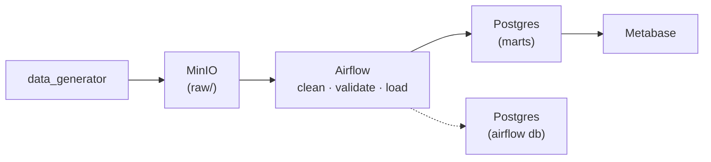

# Mini Data Platform

[](https://github.com/Joh-Ishimwe/DEM11_mini-data-platform/actions/workflows/main.yml)

A Dockerised, end-to-end data platform built to demonstrate a full CI/CD
workflow for a data pipeline: synthetic sales data lands in object storage,
Airflow cleans and validates it, Postgres stores it, and Metabase turns it
into a dashboard - all wired up with GitHub Actions.

---

## Architecture



| Service | Image | Purpose | URL |
|---|---|---|---|
| Postgres | `postgres:16-alpine` | warehouse + Airflow metadata + Metabase app DB | `localhost:5432` |
| MinIO | `quay.io/minio/minio` | S3-compatible landing zone | `localhost:9001` (console) |
| Airflow | `apache/airflow:2.10.2` | orchestration | `localhost:8080` |
| Metabase | `metabase/metabase` | BI dashboards | `localhost:3000` |

**One Postgres container, three logical databases.** `analytics` is the
warehouse, `airflow` is Airflow's own bookkeeping, `metabase` stores
dashboards. They are separate on purpose: a bad transformation must not be
able to corrupt Airflow's state. In production these would be three separate
instances; see `docs/decisions.md`.

---

## Quick start

```bash
git clone https://github.com/Joh-Ishimwe/DEM11_mini-data-platform.git
cd DEM11_mini-data-platform
cp .env.example .env          # then edit the passwords
make install
make hooks
make up
make metabase-setup            # connects Metabase and builds the dashboard
```

Then open Airflow at `localhost:8080`, MinIO at `localhost:9001`, Metabase at
`localhost:3000`. Generate a file and drop it in the pipeline's path with:

```bash
make seed                                  # writes to data/samples/
python -m data_generator.generate --rows 5000 --profile messy --upload   # or straight into MinIO
```

```bash
make test      # fast unit tests
make lint      # everything CI lints
make reset     # nuke all data and start clean
make help      # all commands
```

---

## Repository layout

```
dags/                Airflow DAGs. THIN: orchestration only, no business logic.
src/                 All real logic lives here, unit-testable without Airflow.
  ingestion/         MinIO access, timeouts, transient/permanent error split
  transformations/   cleaning (pure), validation (fatal vs quarantine), business rules
  storage/           idempotent upserts, transactions, quarantine, run metrics
  monitoring/        structured JSON logging with run_id
  utils/             config, error hierarchy, retry with backoff
data_generator/      synthetic sales data, four profiles including broken ones
tests/               unit / integration / data_quality / e2e
config/              settings.yaml, postgres/init.sql
.github/workflows/   main.yml - the whole CI/CD pipeline
docs/                architecture, decisions, data dictionary, testing strategy, runbook
data/samples/        COMMITTED fixtures. data/raw/ is gitignored.
```

**The most important rule in this repo:** logic goes in `src/`, not in
`dags/`. Anything inside a DAG file can only be tested by running Airflow.
Anything in `src/` runs in milliseconds on a CI runner with no Docker at all.

---

## CI/CD

`.github/workflows/main.yml`, cheapest checks first:

| Job | Runs on | Roughly |
|---|---|---|
| `lint` | every PR + push | 40s |
| `unit-tests` | after lint | 1m |
| `integration-tests` | Postgres + MinIO service containers | 4m |
| `dag-validation` | imports every DAG, checks owner/retries/timeout/cycles | 2m |
| `build-images` | after the above pass | 4m |
| `e2e-data-flow` | merge to master, tags, nightly | 15m |
| `deploy` | version tags, behind a manual approval gate | |

**Why e2e is not on every PR:** it is slow and occasionally flaky, and a check
people learn to ignore is worse than no check. Fast signals on every push,
expensive signals less often.

---

## Versioning and rollback

Semantic versioning on tags: `v1.2.3` = MAJOR.MINOR.PATCH.
A MAJOR bump here means the pipeline's **output shape** changed (column
renamed or dropped, type changed, metric redefined), which breaks everything
downstream.

Rollback: Actions → CI/CD → Run workflow → `rollback_to: v1.0.0`.
Re-deploys a known-good version. A tested old version beats a rushed hot-fix.

---

## Error-handling guarantees

Built in from the start, not bolted on:

- A timeout on every network and database call
- Retry with exponential backoff and jitter for transient failures
- `TransientError` vs `PermanentError`: a 404 is never retried
- Structured JSON logs with `run_id` and `source_file`, never `print()`
- Bad rows are quarantined to `staging.rejected_rows`, never fatal
- Every file loads inside one transaction: no half-loaded files
- Upsert on `order_id`: re-running a file cannot duplicate revenue

---

## Documentation

| File | What it answers |
|---|---|
| `docs/architecture.md` | Why the system is shaped this way |
| `docs/decisions.md` | What was chosen, and what was given up |
| `docs/data_dictionary.md` | What every column means |
| `docs/testing_strategy.md` | What is tested, where, and why |
| `docs/runbook.md` | It is 3am and it is red. Now what? |
| `docs/ownership.md` | Who would own each piece in a real team |
