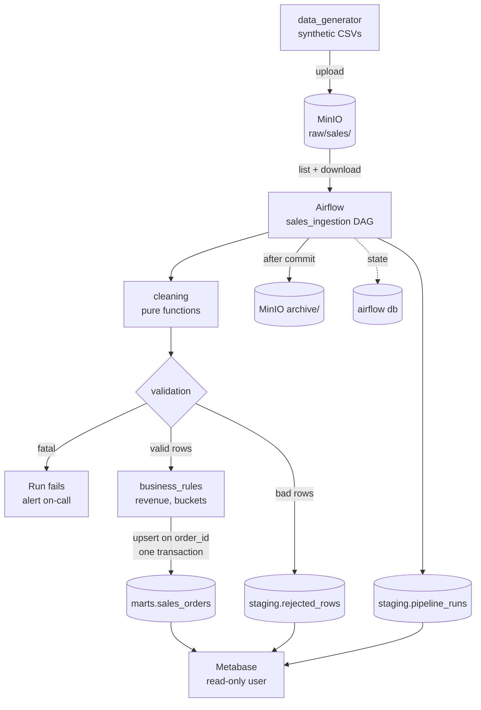

# Diagram source

Paste into any Mermaid renderer (GitHub renders it natively).

```mermaid
flowchart TD
    G[data_generator<br/>synthetic CSVs] -->|upload| M[(MinIO<br/>raw/sales/)]
    M -->|list + download| A[Airflow<br/>sales_ingestion DAG]
    A --> C[cleaning<br/>pure functions]
    C --> V{validation}
    V -->|fatal| X[Run fails<br/>alert on-call]
    V -->|valid rows| B[business_rules<br/>revenue, buckets]
    V -->|bad rows| Q[(staging.rejected_rows)]
    B -->|upsert on order_id<br/>one transaction| P[(marts.sales_orders)]
    A -->|after commit| AR[(MinIO archive/)]
    A --> R[(staging.pipeline_runs)]
    P --> MB[Metabase<br/>read-only user]
    Q --> MB
    R --> MB
    A -.state.-> AF[(airflow db)]
```
